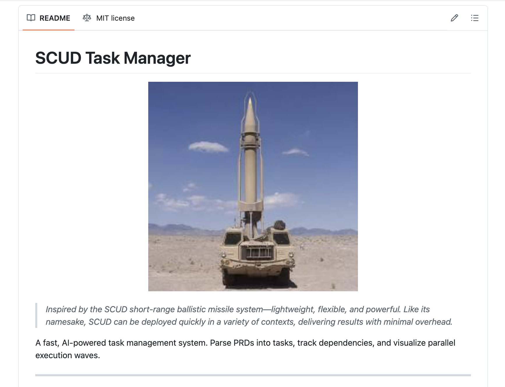

# SCUD Task Manager

<p align="center">
  
</p>

> *Inspired by the SCUD short-range ballistic missile system—lightweight, flexible, and powerful. Like its namesake, SCUD can be deployed quickly in a variety of contexts, delivering results with minimal overhead.*

A fast, AI-powered task management system with both CLI and desktop GUI interfaces. Parse PRDs into tasks, track dependencies, visualize parallel execution waves, and orchestrate AI agents.

SCUD focuses on core task management while providing experimental advanced features for team orchestration and complex workflows.

## Components

### 🚀 SCUD CLI
Fast, lightweight command-line interface for task management and AI orchestration.

### 🖥️ Descartes GUI
Desktop application for visual task management and real-time AI agent control.

---

## Install

### macOS / Linux

```bash
curl -sSf https://raw.githubusercontent.com/pyrex41/scud/master/install.sh | sh
```

### Windows (PowerShell)

```powershell
irm https://raw.githubusercontent.com/pyrex41/scud/master/install.ps1 | iex
```

Or via WSL:

```powershell
wsl curl -sSf https://raw.githubusercontent.com/pyrex41/scud/master/install.sh | sh
```

Installs both `scud` (CLI) and `rho-cli` (default AI harness). Downloads prebuilt binaries when available, falls back to `cargo install`.

### Manual Install

```bash
cargo install scud-cli      # CLI
cargo install rho-agent      # AI harness (provides rho-cli)
cargo install descartes-gui  # Desktop GUI (optional)
```

---

## Quickstart

Get from zero to a running AI swarm in under 5 minutes.

### 1. Install

<details>
<summary><b>macOS / Linux</b></summary>

```bash
curl -sSf https://raw.githubusercontent.com/pyrex41/scud/master/install.sh | sh
```

Verify:
```bash
scud --help
```

</details>

<details>
<summary><b>Windows (PowerShell)</b></summary>

```powershell
irm https://raw.githubusercontent.com/pyrex41/scud/master/install.ps1 | iex
```

The installer adds `scud` to your PATH automatically. Verify in the same terminal:
```powershell
scud --help
```

</details>

### 2. Set up your API key

SCUD needs an LLM provider for AI features. Pick one:

<details>
<summary><b>macOS / Linux</b></summary>

```bash
# xAI (default provider)
export XAI_API_KEY=xai-...

# Or Anthropic
export ANTHROPIC_API_KEY=sk-ant-...

# Or OpenAI
export OPENAI_API_KEY=sk-...
```

Add to your shell profile (`~/.bashrc`, `~/.zshrc`, etc.) to persist across sessions.

</details>

<details>
<summary><b>Windows (PowerShell)</b></summary>

```powershell
# Current session + permanent (persists across terminals)
$env:XAI_API_KEY = "xai-..."
[Environment]::SetEnvironmentVariable('XAI_API_KEY', 'xai-...', 'User')
```

Substitute `ANTHROPIC_API_KEY` or `OPENAI_API_KEY` if using a different provider.

</details>

### 3. Initialize a project

```bash
cd your-project
scud init
```

The interactive setup walks you through three choices:

**Fast model** (used for parsing, expanding, and most AI calls):
```
? Select fast LLM provider
> xAI (Grok)                              # <-- select xAI
  Anthropic API key (ANTHROPIC_API_KEY)
  OpenAI (GPT API)
  ...

? Select fast model
> xai/grok-code-fast-1                    # <-- default, great for speed
  xai/grok-4-1-fast
  Custom (enter model name)
```

**Smart model** (used for complex analysis like PRD coverage validation):
```
? Select smart LLM provider
> xAI (Grok)

? Select smart model
  xai/grok-code-fast-1
> xai/grok-4-1-fast                       # <-- pick a stronger model
  Custom (enter model name)
```

**Backpressure validation** (commands run between swarm waves to catch failures):
```
=== VALIDATION COMMANDS (BACKPRESSURE) ===
Auto-detected commands:
  · cargo build
  · cargo test

? How would you like to configure validation?
> Use auto-detect (recommended)
  Configure custom commands
  Skip (configure later)
```

Output:
```
Initializing SCUD...

SCUD initialized successfully!

Configuration:
  Default Provider: xai (grok-code-fast-1)
  Fast Provider:    xai (grok-code-fast-1)
  Smart Provider:   xai (grok-4-1-fast)
```

You can also skip the interactive prompts: `scud init --provider xai`

### 4. Generate tasks from a PRD

Write a PRD (or use an existing markdown doc), then run the full pipeline:

```bash
scud generate docs/prd.md --tag todo-app
```

This runs three phases automatically:

```
━━━━━━━━━━━━━━━━━━━━━━━━━━━━━━━━━━━━━━━━━━━━━━━━━━
Generate Pipeline (tag: todo-app)
━━━━━━━━━━━━━━━━━━━━━━━━━━━━━━━━━━━━━━━━━━━━━━━━━━

Phase 1: Parsing PRD into tasks...
Reading PRD from: docs/prd.md
Using fast model: xai/grok-code-fast-1

✅ PRD parsed and task group created!
Tag:                 todo-app
Tasks created:       10

Phase 2: Expanding complex tasks into subtasks...
Expanding 3 task(s) with 10 concurrent requests...
✓ Task 10 expanded into 2 subtasks
✓ Task 8 expanded into 2 subtasks
✓ Task 9 expanded into 2 subtasks

✅ Task expansion complete!
Expanded:                 3 (3 succeeded, 0 failed)
Total subtasks created:   6

Phase 3: Validating task dependencies...
✓ No dependency issues found!

━━━━━━━━━━━━━━━━━━━━━━━━━━━━━━━━━━━━━━━━━━━━━━━━━━
✅ Generate pipeline complete!
━━━━━━━━━━━━━━━━━━━━━━━━━━━━━━━━━━━━━━━━━━━━━━━━━━
```

Inspect the results:

```bash
$ scud list --tag todo-app
```
```
Phase: todo-app

   #  ID          Title                            Status         Cplx  Pri   Agent
──────────────────────────────────────────────────────────────────────────────────────
   1  1           Plan application structure ...   ○ Pending         2  High  planner
   2  2           Set up project file and imp...   ○ Pending         1  High  fast-builder
   3  3           Implement JSON data persist...   ○ Pending         3  Med   builder
   4  4           Implement add task function...   ○ Pending         3  High  builder
   5  5           Implement list tasks functi...   ○ Pending         3  High  builder
   6  6           Implement complete task fun...   ○ Pending         3  High  builder
   7  7           Implement delete task funct...   ○ Pending         3  High  builder
   8  8           Implement command-line inte...   ◈ Expanded        5  High  builder
   9  8.1         Set up argparse structure f...   ○ Pending         0  High  -
  10  8.2         Implement routing and user-...   ○ Pending         0  Med   -
  11  9           Write unit tests for core f...   ◈ Expanded        5  Med   tester
  12  9.1         Write unit tests for CRUD o...   ○ Pending         0  High  -
  13  9.2         Write unit tests for persis...   ○ Pending         0  Med   -
  14  10          Perform integration testing...   ◈ Expanded        5  High  reviewer
  15  10.1        Perform End-to-End Integrat...   ○ Pending         0  High  -
  16  10.2        Fix Bugs and Validate Requi...   ○ Pending         0  High  -

Total: 16 tasks
```

```bash
$ scud waves --tag todo-app
```
```
Execution Waves (max 5 parallel)
==================================================

Wave 1: 4 tasks
    ○ 1 Plan application structure and data model [2] @planner
    ○ 9.1 Write unit tests for CRUD operations
    ○ 10.1 Perform End-to-End Integration Testing
    ○ 8.1 Set up argparse structure for CLI commands

Wave 2: 4 tasks
    ○ 8.2 Implement routing and user-friendly integration <- 8.1
    ○ 10.2 Fix Bugs and Validate Requirements <- 10.1
    ○ 2 Set up project file and imports [1] @fast-builder <- 1
    ○ 9.2 Write unit tests for persistence function <- 9.1

Wave 3: 1 task
    ○ 3 Implement JSON data persistence [3] @builder <- 2

...

Summary
------------------------------
  Total tasks:   13
  Total waves:   7
  Speedup:       1.9x
  (from 13 sequential to 7 parallel rounds)
```

### 5. Launch a swarm

Preview the execution plan first:

```bash
$ scud swarm --tag todo-app --dry-run
```
```
SCUD Swarm Mode
══════════════════════════════════════════════════
Tag:                 todo-app
Round size:          5
Validation:          enabled
Terminal:            tmux
Harness:             claude

Execution Plan (dry-run)
══════════════════════════════════════════════════

Wave 1 - 4 task(s), 1 round(s)
  Round 1:
    ○ 1 | Plan application structure and data model
    ○ 8.1 | Set up argparse structure for CLI commands
    ○ 9.1 | Write unit tests for CRUD operations
    ○ 10.1 | Perform End-to-End Integration Testing

Wave 2 - 4 task(s), 1 round(s)
  Round 1:
    ○ 2 | Set up project file and imports
    ○ 8.2 | Implement routing and user-friendly integration
    ○ 9.2 | Write unit tests for persistence function
    ○ 10.2 | Fix Bugs and Validate Requirements

...

Summary
------------------------------
  Total waves:  7
  Total tasks:  13
  Speedup:      1.9x

No agents spawned (dry-run mode).
```

Then launch for real:

```bash
# Default: wave mode with tmux sessions (interactive)
scud swarm --tag todo-app

# Or headless (no tmux, runs in background)
scud swarm --tag todo-app --headless

# Limit concurrency
scud swarm --tag todo-app --round-size 3
```

The swarm will:
- Compute ready tasks from the dependency graph
- Spawn an AI agent per task (in isolated git worktrees)
- Run backpressure validation (build/test) between waves
- Advance to the next wave automatically

Monitor progress:

```bash
scud stats --tag todo-app     # Completion stats
scud retro                    # Session retrospective
```

### 6. Work manually (optional)

You can also work through tasks one at a time:

```bash
$ scud next --tag todo-app
```
```
Next Available Task:

ID:                  1
Title:               Plan application structure and data model
Complexity:          2
Priority:            High

Description:
Design the overall architecture of the single-file todo.py application,
including the data model for tasks. Define the structure for storing tasks
in memory and persisting to JSON.

To start this task:
  scud set-status 1 in-progress
```

```bash
scud set-status 1 in-progress        # Claim it
# ... do the work ...
scud set-status 1 done               # Mark complete
scud commit -m "Implement feature"   # Task-aware git commit
```

---

**SCUD CLI Quick Reference:** [docs/reference/QUICK_REFERENCE.md](docs/reference/QUICK_REFERENCE.md)
**Orchestrator Pattern:** [docs/orchestrator.md](docs/orchestrator.md)
**Descartes GUI Details:** [descartes-gui/README.md](descartes-gui/README.md)

---

## Core Concepts

### SCG Format

Tasks are stored in **SCG (SCUD Graph)** format—a token-efficient, human-readable text format that achieves ~75% token reduction compared to JSON. SCG explicitly represents the task dependency graph with sections for nodes, edges, and metadata. Inspired in part by Nikolai Mushegian's [JAMS spec](https://nikolai.fyi/jams/) ([GitHub](https://github.com/nmushegian/jams)).

```
@nodes
auth:1 | Design auth system | X | 13 | H
auth:1.1 | Implement JWT | D | 5 | H

@edges
auth:1.1 -> auth:1
```

**Full spec:** [docs/reference/SCG_FORMAT_SPEC.md](docs/reference/SCG_FORMAT_SPEC.md)

### DAG-Driven Execution
Tasks become ready when their dependencies complete. No manual phase management required.

```
Task 1 ──┐
         ├──> Task 3 ──> Task 5
Task 2 ──┘      │
                └──> Task 4
```

### Tags
Group related tasks together (e.g., `auth-system`, `payment-flow`). Each tag has its own task graph.

### Parallel Execution

SCUD supports two execution strategies for parallel agent orchestration:

**Execution Modes:**

**Wave Mode** (default): Batches ready tasks into waves, spawns agents in parallel, waits for completion, validates with backpressure, then proceeds to next wave.
```bash
scud swarm --tag my-feature  # Default wave mode with tmux
scud swarm --tag my-feature --headless  # Wave mode without tmux sessions
```

**Beads Mode**: Continuous polling - spawns agents immediately when tasks become ready, without waiting for batch boundaries.
```bash
scud swarm --tag my-feature --swarm-mode beads
```

**Terminal Management:**
- **tmux mode** (default): Spawns interactive tmux sessions for each agent with live monitoring
- **headless mode**: Runs agents in background processes without terminal sessions
- **Monitor sessions**: Use `scud monitor --session <name>` to watch running swarms

All modes include SQLite event logging, backpressure validation, and salvo worktree isolation. See [docs/orchestrator.md](docs/orchestrator.md) for details.

---

## Descartes GUI

The desktop GUI provides a visual interface for task management and AI agent orchestration, complementing the SCUD CLI.

### Features

#### Wave Visualization
- **Interactive waves**: Click to start tasks in parallel execution waves
- **Dependency awareness**: Visual representation of task relationships
- **Status tracking**: Real-time progress indicators

#### Agent Control
- **One-click execution**: Start agents directly from the GUI
- **Real-time control**: Pause, resume, or cancel running agents
- **Live monitoring**: Stream agent output and progress

#### Task Management
- **Visual task board**: Drag-and-drop task organization
- **Status updates**: Mark tasks complete directly in the interface
- **Progress tracking**: Overall project completion statistics

### Setup
```bash
# Install GUI
cargo install descartes-gui

# Initialize SCUD project first
scud init
scud generate docs/feature.md --tag my-project

# Launch GUI
descartes-gui
```

The GUI reads from SCUD's `.scud/` storage directory and provides a user-friendly interface for the same underlying task management system.

---

## Key Features

### Pure Rust CLI
- **50x faster** than JavaScript alternatives
- **42x fewer tokens** (500 vs 21k)
- **Single binary** - zero runtime dependencies
- **Self-contained** - embedded assets, no external files

### DAG-Driven Execution
- **Dependency graphs** - tasks ready when deps complete
- **Parallel waves** - visualize concurrent work with `scud waves`
- **Smart scheduling** - `scud next` finds ready tasks

### Web Dashboard
- **Visual task board** - `scud view` opens browser dashboard
- **Mermaid diagrams** - dependency graph visualization
- **Real-time stats** - progress tracking

### Desktop GUI (Descartes)
- **Wave visualization** - Interactive task waves with one-click execution
- **Real-time agent control** - Pause, resume, cancel running agents
- **Live output streaming** - Monitor agent progress in real-time
- **Visual task management** - Drag-and-drop task organization

### Attractor Mode (Pipeline Engine)
- **Generate from PRDs** - `scud generate --pipeline` creates pipelines via interactive interview + LLM
- **DOT and SCG formats** - define pipelines as DOT graphs or native SCG files
- **Node types** - LLM calls, shell tools, human gates, conditionals, parallel fan-out/fan-in
- **Format conversion** - `import`/`export` between DOT and SCG
- **Checkpoint/resume** - interrupt and resume pipelines from any node
- **Retry with backoff** - exponential backoff with jitter on failures
- **Stylesheets** - CSS-like model/provider defaults per node class
- **Condition routing** - edge expressions for dynamic graph traversal
- See [Attractor Mode docs](docs/attractor.md)

### Orchestrator Support
- **Parallel agents** - spawn multiple AI agents via tmux or headless execution
- **Salvo worktrees** - automatic git worktree isolation per tag
- **SQLite event storage** - queryable event logs, transcript search, session history
- **Transcript capture** - real-time import of Claude Code conversation logs
- **Live monitoring** - heartbeat tracking, orphan detection, stale timeouts
- **Task locking** - `scud claim/release` prevents conflicts
- **Session monitoring** - `scud whois` tracks active work

---

## Documentation

**Getting Started:**
- [Quick Reference](docs/reference/QUICK_REFERENCE.md) - SCUD CLI command cheat sheet
- [SCG Format Spec](docs/reference/SCG_FORMAT_SPEC.md) - Task file format
- [Descartes GUI](descartes-gui/README.md) - Desktop interface guide

**Swarm & Orchestration:**
- [Orchestrator Pattern](docs/orchestrator.md) - Swarm modes and multi-agent workflows
- [Parallel Features](docs/features/PARALLEL_FEATURES.md) - Task orchestration (includes experimental features)

**Attractor Mode:**
- [Attractor Mode](docs/attractor.md) - DOT-based AI workflow pipelines

**Development:**
- [Development Logs](log_docs/) - Implementation details & history

---

## Commands

### Setup & Orientation
```bash
scud init                          # Initialize SCUD in current directory
scud warmup                        # Quick session orientation (recent commits, active tasks)
scud tags                          # List/set active phase tags
```

### Core Commands (Instant)
```bash
scud list [--tag <tag>]            # List tasks
scud show <id>                     # Show task details
scud next [--tag <tag>]            # Find next ready task
scud set-status <id> <status>      # Update task status
scud stats [--tag <tag>]           # Show statistics
scud waves [--tag <tag>]           # Show parallel execution waves
```

### Visualization
```bash
scud view                          # Open task viewer in browser
scud mermaid [--tag <tag>]         # Generate Mermaid diagram
```

### AI Commands (Requires API Key)
```bash
scud generate <file> --tag <tag>   # Full pipeline: parse → expand → validate
scud generate --pipeline <file> --tag <tag>  # Generate Attractor pipeline from PRD
scud parse <file> --tag <tag>      # Parse PRD/doc into initial tasks
scud expand [--task <id>]          # Break down complex tasks into subtasks
scud analyze-complexity            # Analyze task complexity (AI-powered)
scud check-deps --tag <tag>        # Validate task dependencies
scud reanalyze-deps                # Suggest cross-tag dependencies
```

Default provider: `xai`, model: `xai/grok-code-fast-1`. Configure with `scud config`.

Project guidance files in `.scud/guidance/*.md` are automatically included in AI prompts.

### Swarm Commands (Parallel Execution)
```bash
scud swarm --tag <tag>             # Run wave-based parallel execution
scud swarm --swarm-mode tmux       # Tmux-based spawning (default - interactive)
scud swarm --swarm-mode headless   # Headless mode (no terminals/sessions)
scud swarm --swarm-mode beads      # Continuous polling mode (fluid execution)
scud swarm --headless              # Shorthand for --swarm-mode headless
scud swarm --round-size 5          # Max tasks per round (default: 5)
scud swarm --harness opencode      # AI harness: claude, opencode (default: claude)
scud swarm --dry-run               # Show execution plan without spawning
scud swarm --review                # Enable code review after each wave
scud swarm --no-validate           # Skip backpressure validation

# Swarm monitoring and retrospectives
scud retro [session-id]            # View session retrospective/timeline
scud watch --session <session>     # Watch running swarm via live events
```

**Execution Modes:**
- **tmux** (default): Spawns agents in tmux sessions with live monitoring
- **headless**: Runs agents in background without terminal sessions
- **beads**: Continuous polling - starts new agents as tasks become ready

### Advanced Features (Experimental)

These features are under active development and may change significantly.

#### Worktree Isolation (Salvo) - Experimental
```bash
scud salvo list                    # List isolated worktrees
scud salvo sync <tag>              # Sync worktree back to main
scud salvo remove <tag>            # Remove worktree and branch
```

#### Transcript Management - Experimental
```bash
scud transcript search <query>     # Search conversation logs
scud transcript stats              # Show transcript statistics
scud transcript list               # List available transcripts
scud transcript view [--session]   # View conversation transcript
scud transcript import             # Import project transcripts
```

#### Team Orchestration - Experimental
```bash
scud assign <id> <name>            # Assign task to team member
scud who-is [--tag <tag>]          # See who's working on what
scud next-batch [--limit 5]        # Get multiple tasks at once
scud doctor workflow [--tag <tag>] # Diagnose stuck task states
scud doctor scan-ext               # Scan and validate extensions
```

### Attractor Mode (Pipeline Engine)
```bash
# Generate a pipeline from a PRD (interactive interview + LLM)
scud generate --pipeline docs/prd.md --tag build-api
scud generate --pipeline docs/prd.md --tag build-api --dry-run

# Execute pipelines
scud attractor run <file>                      # Execute a pipeline (.dot or .scg)
scud attractor run <file> --headless           # Auto-approve human gates
scud attractor run <file> --simulated          # Dry-run with no LLM calls
scud attractor run <file> --model opus         # Override model
scud attractor run <file> --provider xai       # Override provider/harness
scud attractor run <file> --resume <ckpt>      # Resume from checkpoint
scud attractor validate <file>                 # Validate without executing
scud attractor export <file> --format dot      # Convert SCG → DOT (or DOT → SCG)
scud attractor import <file.dot> -o out.scg    # Import DOT as SCG
```

Pipelines can be generated from PRDs via `scud generate --pipeline`, written by hand as DOT `digraph` files (node shapes determine behavior), or as SCG files with `mode pipeline` (handler types in `@pipeline` section). All formats support the same execution semantics. See [docs/attractor.md](docs/attractor.md) for the full reference.

### Utilities
```bash
scud log <id> "message"            # Add log entry to task
scud log-show <id>                 # Show task log entries
scud commit [-m "msg"]             # Git commit with task context
```

### Task Cleanup
```bash
scud clean [--tag <tag>]           # Archive tasks (default, recoverable)
scud clean --list                  # List archived phases
scud clean --restore <name>        # Restore an archived phase
scud clean --keep tag1,tag2        # Archive all except specified tags
scud clean --delete                # Permanently delete (use with caution)
```

> **Note:** `scud clean` now archives by default instead of deleting. Use `--delete` for permanent removal.

---

## Example Workflow

```bash
# 1. Initialize
scud init

# 2. Generate tasks from PRD (parse → expand → validate in one command)
scud generate docs/feature.md --tag auth-system

# 3. View execution plan
scud waves --tag auth-system
# Shows which tasks can run in parallel

# 4. Work on next ready task
scud next --tag auth-system
# Returns: Task 1 is ready

scud set-status 1 in-progress
# ... do the work ...
scud set-status 1 done

# 5. Track progress
scud stats --tag auth-system
# Shows progress: 8/10 complete

# 6. Visualize
scud view
# Opens task viewer in browser
```

See [docs/orchestrator.md](docs/orchestrator.md) for parallel execution patterns.

### Combined CLI + GUI Workflow
```bash
# Use CLI for project setup and task generation
scud init
scud generate docs/feature.md --tag my-project
scud waves --tag my-project

# Use GUI for visual task management and execution
descartes-gui
# In GUI: View task waves, start agents, monitor progress

# Use CLI for detailed development work
scud next --tag my-project
scud set-status 1 in-progress
# ... implement the feature ...
scud set-status 1 done
scud commit -m "Add JWT authentication system"
```

---

## Why SCUD?

**DAG-Driven:**
- Tasks become ready when dependencies complete
- Visualize parallel execution waves
- Smart scheduling finds ready work

**Fast & Simple:**
- Rust CLI is instant (<50ms)
- SCG format is human-readable and git-friendly
- Works offline (core commands)
- No vendor lock-in

**Visual:**
- Web dashboard with task board
- Mermaid dependency diagrams
- Real-time progress tracking

**Orchestrator-Ready:**
- Parallel agent spawning via tmux or headless modes
- SQLite event storage and session history
- Swarm execution with wave-based or continuous modes
- Live monitoring with retrospective analysis
- Experimental: Advanced worktree isolation and transcript management

---

## Requirements

### SCUD CLI
- **Rust toolchain** (for building from source)
- **xAI API key** (for AI features only; core commands work offline)

### Descartes GUI
- **Rust toolchain** (for building from source)
- **System libraries** (Linux: `libxkbcommon-dev libwayland-dev`)

### API Keys
```bash
# For SCUD CLI AI features
export XAI_API_KEY=xai-...

# For Descartes GUI (Claude models)
export ANTHROPIC_API_KEY=sk-ant-...
```

**Alternative providers:** Anthropic (`ANTHROPIC_API_KEY`), OpenAI (`OPENAI_API_KEY`), OpenRouter (`OPENROUTER_API_KEY`). Configure with `scud config`.

---

## File Structure

```
.scud/
├── scud.db                   # SQLite database (events, transcripts, sessions)
├── tasks/tasks.scg           # All tasks in SCG format
├── config.toml               # Provider/model settings
├── active-tag                # Currently active tag
├── current-task              # Active task ID (for commits)
├── guidance/                 # Project guidance for AI prompts
│   └── *.md                  # Markdown files auto-loaded
├── archive/                  # Archived phases (from scud clean)
│   └── <tag>_<timestamp>.scg # Timestamped archive files
├── swarm/                    # Swarm execution data
│   ├── sessions/             # Session state and history
│   └── *.lock                # Session lock files
├── agents/                   # Extension manifests (experimental)
│   └── *.toml                # Custom agent definitions
└── logs/                     # Task log entries
```

### Project Guidance

You can provide project-specific context that will be automatically included in AI prompts. Create markdown files in `.scud/guidance/`:

```bash
# Example: Add coding standards
echo "# Coding Standards
- Use TypeScript strict mode
- All functions must have JSDoc comments
- Maximum function length: 50 lines" > .scud/guidance/coding-standards.md

# Example: Add architecture notes
echo "# Architecture
- Frontend: React with hooks
- Backend: Express.js
- Database: PostgreSQL" > .scud/guidance/architecture.md
```

All `.md` files in this folder are automatically loaded when running `scud parse` or `scud expand`. Use `--no-guidance` to skip loading guidance.

---

## Development

### Building Both Components

```bash
# Clone repository
git clone https://github.com/pyrex41/scud.git
cd scud

# Build SCUD CLI
cd scud-cli
cargo build --release
./target/release/scud install  # Optional: install globally

# Build Descartes GUI
cd ../descartes-gui
cargo build --release

# Test both
./target/release/scud init
./target/release/descartes-gui
```

### System Dependencies

**macOS:** No additional dependencies required.

**Linux:**
```bash
# For Descartes GUI
sudo apt install libxkbcommon-dev libwayland-dev
```

**Publishing:** See [PUBLISHING.md](PUBLISHING.md) for CI/CD setup and release process.

---

## Contributing

Issues and PRs welcome at [github.com/pyrex41/scud](https://github.com/pyrex41/scud)

---

## License

MIT

---

## Learn More

- **SCUD CLI Quick Reference:** [docs/reference/QUICK_REFERENCE.md](docs/reference/QUICK_REFERENCE.md)
- **SCG Format:** [docs/reference/SCG_FORMAT_SPEC.md](docs/reference/SCG_FORMAT_SPEC.md)
- **Attractor Mode:** [docs/attractor.md](docs/attractor.md)
- **Orchestrator Pattern:** [docs/orchestrator.md](docs/orchestrator.md)
- **Parallel Features:** [docs/features/PARALLEL_FEATURES.md](docs/features/PARALLEL_FEATURES.md)
- **Descartes GUI:** [descartes-gui/README.md](descartes-gui/README.md)
- **Changelog:** [CHANGELOG.md](CHANGELOG.md)
- **Related:** [github.com/pyrex41/descartes](https://github.com/pyrex41/descartes)

**Happy building!**
