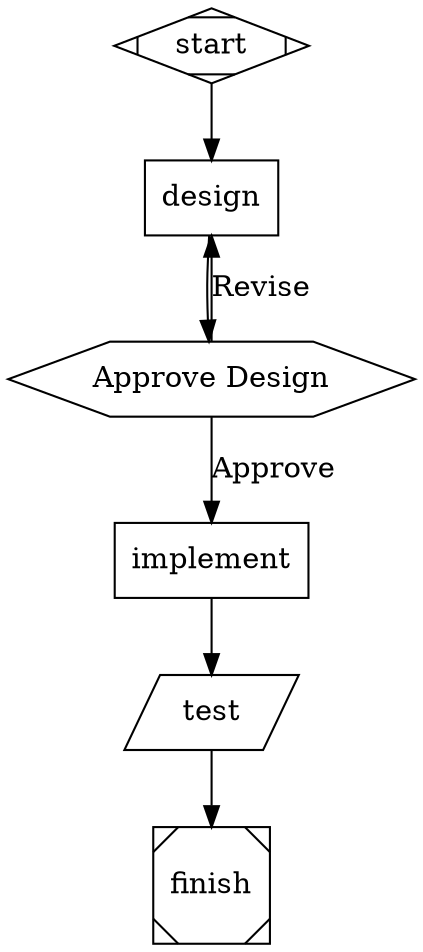
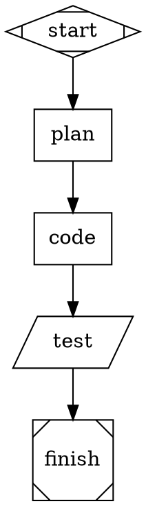
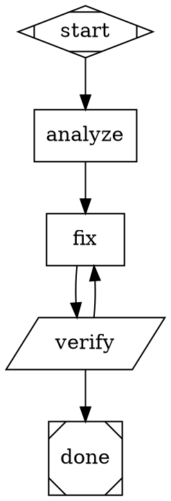
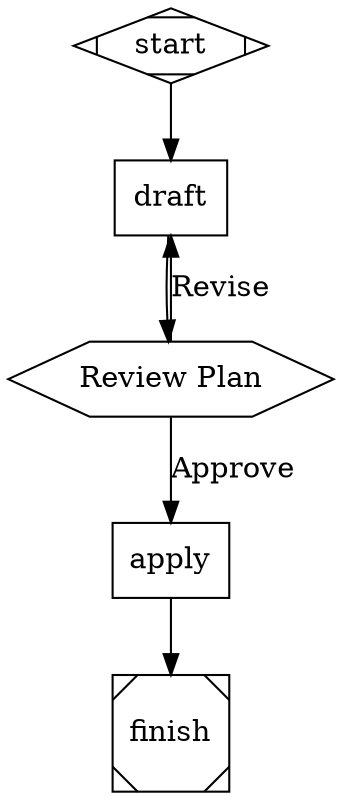
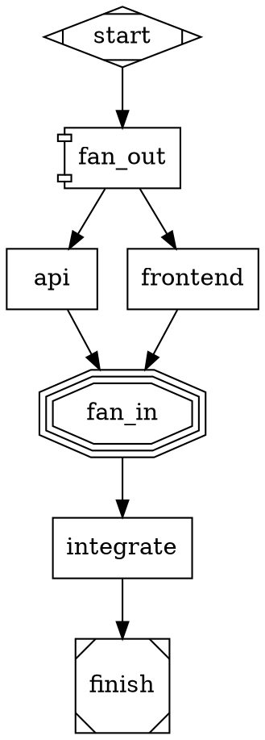

# Attractor Mode

Attractor Mode is a pipeline engine for multi-step AI workflows defined as DOT graphs. Nodes represent tasks — LLM calls, shell commands, human approval gates, conditional branches, parallel fan-out — and edges represent transitions with optional conditions.

```
DOT file → Parser → Graph → Transforms → Validator → Runner
                                                        ↓
                                      AgentBackend ← Handler Registry
```

## Quick Start

```bash
# Run a pipeline
scud attractor run pipeline.dot

# Validate without executing
scud attractor validate pipeline.dot

# Use a specific model/provider
scud attractor run pipeline.dot --model claude-sonnet-4-5-20250929 --provider anthropic

# Run without LLM calls (simulated)
scud attractor run pipeline.dot --simulated

# Run headless (auto-approve human gates)
scud attractor run pipeline.dot --headless

# Resume from checkpoint
scud attractor run pipeline.dot --resume runs/my-run/checkpoint.json
```

## Writing Pipelines

Pipelines are DOT `digraph` files. Node shapes determine behavior:



### Node Types

| Shape | Handler | Purpose |
|---|---|---|
| `Mdiamond` | `start` | Entry point (exactly one required) |
| `Msquare` | `exit` | Terminal node (at least one required) |
| `box` / `rect` | `codergen` | LLM call with prompt |
| `hexagon` | `wait.human` | Human approval gate |
| `diamond` | `conditional` | Routing node (edges carry conditions) |
| `parallelogram` | `tool` | Shell command execution |
| `component` | `parallel` | Fan-out to parallel branches |
| `tripleoctagon` | `parallel.fan_in` | Fan-in from parallel branches |
| `house` | `stack.manager_loop` | Supervised execution (experimental) |

You can also set `type="handler_name"` to override the shape-based detection.

### Node Attributes

| Attribute | Type | Default | Description |
|---|---|---|---|
| `prompt` | string | `""` | LLM prompt. Supports `$goal` and `$context.KEY` variables |
| `label` | string | node ID | Display name |
| `max_retries` | int | `0` | Retry attempts on failure |
| `goal_gate` | bool | `false` | On exit nodes: require goal satisfaction |
| `retry_target` | string | — | Node to route to after exhausted retries |
| `fallback_retry_target` | string | — | Secondary retry target |
| `timeout` | duration | — | Per-node timeout (`"30s"`, `"5m"`, `"1h"`) |
| `llm_model` | string | — | Model override for this node |
| `llm_provider` | string | — | Provider override for this node |
| `reasoning_effort` | string | `"high"` | `"high"`, `"medium"`, or `"low"` |
| `class` | string | — | Space-separated class names for stylesheet matching |
| `tool_command` | string | — | Shell command for `tool` nodes |

### Edge Attributes

| Attribute | Type | Default | Description |
|---|---|---|---|
| `label` | string | `""` | Display label; used in human gate routing |
| `condition` | string | `""` | Condition expression for routing |
| `weight` | int | `0` | Priority tiebreaker (higher wins) |

### Graph Attributes

Set via `graph [...]`:

| Attribute | Description |
|---|---|
| `goal` | Goal string; expanded into `$goal` in prompts |
| `model_stylesheet` | CSS-like stylesheet for model/provider defaults |

## Variable Expansion

Prompts support two variable forms:

- **`$goal`** — Replaced with the graph-level `goal` attribute
- **`$context.KEY`** — Replaced with the value of `KEY` from the execution context

Context values are set by tool nodes (stdout, exit codes) and can be read by subsequent nodes:

```dot
run_tests [shape=parallelogram, tool_command="cargo test 2>&1"]
analyze   [shape=box, prompt="These test results need fixing:\n$context.run_tests.stdout"]

run_tests -> analyze
```

## Conditions

Edge conditions control routing after a node completes. The syntax is simple equality expressions joined with `&&`:

```
condition="outcome=success"
condition="outcome!=failure"
condition="preferred_label=approve"
condition="outcome=success && context.approved=true"
condition="test_passed=true"
```

### Condition Keys

| Key | Resolves to |
|---|---|
| `outcome` | Node status: `"success"`, `"failure"`, `"skipped"`, `"timeout"`, `"cancelled"` |
| `preferred_label` | The label chosen by the handler (e.g., human gate selection) |
| `context.KEY` | Value from execution context |
| `KEY` | Also checks context directly |

## Edge Selection Algorithm

After each node completes, the runner selects the next edge using a 5-step algorithm:

1. **Condition match** — Find edges with a `condition` that evaluates to true. If exactly one matches, take it.
2. **Preferred label** — If the handler set a `preferred_label`, match it against edge labels (case-insensitive).
3. **Suggested next** — If the handler suggested specific next node IDs, follow the first matching edge.
4. **Highest weight** — Among unconditional edges, pick the one with the highest `weight`.
5. **Lexical tiebreak** — Among equal-weight edges, pick the first alphabetically by target node ID.

## Stylesheets

Set model, provider, and reasoning effort defaults without repeating attributes on every node. Uses CSS-like selector syntax in the `model_stylesheet` graph attribute:

```dot
graph [model_stylesheet="
    * { model: \"claude-3-haiku\"; reasoning_effort: \"medium\" }
    .critical { model: \"claude-3-opus\" }
    #final_review { provider: \"anthropic\"; reasoning_effort: \"high\" }
"]
```

### Selectors

| Selector | Specificity | Matches |
|---|---|---|
| `*` | 0 | All nodes |
| `.classname` | 1 | Nodes with that class |
| `#node_id` | 2 | Specific node by ID |

Higher specificity wins. Explicit node attributes always override stylesheet values.

### Properties

| Property | Effect |
|---|---|
| `model` | Sets `llm_model` |
| `provider` | Sets `llm_provider` |
| `reasoning_effort` | Sets `reasoning_effort` |

## Retry and Error Handling

Nodes with `max_retries > 0` will retry on failure with exponential backoff (2s base, 2x multiplier, 30s max, random jitter):

```dot
generate [shape=box, prompt="Generate code", max_retries=3]
fallback [shape=box, prompt="Try simpler approach"]

generate [retry_target="fallback"]
```

If all retries are exhausted, the runner routes to `retry_target` (then `fallback_retry_target`). If neither exists, the pipeline fails.

### Goal Gates

Exit nodes can require goal satisfaction before completing:

```dot
finish [shape=Msquare, goal_gate=true, retry_target="refine"]
```

The runner checks `context["goal_satisfied"]` — if not `true`, it routes to `retry_target` for another attempt.

## Checkpoint and Resume

Every node completion writes a `checkpoint.json` to the run directory. To resume a failed or interrupted pipeline:

```bash
scud attractor run pipeline.dot --resume runs/my-run-20260224-103000/checkpoint.json
```

The runner resumes from the last completed node.

### Checkpoint Format

```json
{
  "timestamp": "2026-02-24T10:30:45+00:00",
  "current_node": "implement",
  "completed_nodes": ["start", "design", "review"],
  "node_retries": { "implement": 1 },
  "node_statuses": {
    "start": "success",
    "design": "success",
    "review": "success"
  },
  "context": { "values": {} },
  "log": []
}
```

## Run Directory

Each execution creates a timestamped run directory:

```
runs/{pipeline}-{YYYYMMDD-HHMMSS}/
├── manifest.json       # Run metadata
├── checkpoint.json     # Live checkpoint (updated each node)
└── {node_id}/
    ├── prompt.md       # Expanded prompt (codergen nodes)
    ├── response.md     # LLM response or tool output
    └── status.json     # {node_id, status, tool_calls}
```

## Backend Configuration

The attractor uses the same backend system as swarm mode. Configuration hierarchy:

1. `--provider` CLI flag
2. `.scud/config.toml` → `[swarm].harness`
3. Default: `"claude"` (Claude Code CLI subprocess)

```toml
# .scud/config.toml
[swarm]
harness = "claude"                    # or "opencode", "direct-api"
model = "xai/grok-code-fast-1"       # default model for agents
direct_api_provider = "xai"          # provider for direct-api harness
```

You can also override per-node via `llm_model` and `llm_provider` attributes, or per-graph via stylesheets.

## Validation

Run `scud attractor validate` to check a pipeline without executing it:

```bash
scud attractor validate pipeline.dot
```

### Validation Rules

**Errors** (block execution):
- Pipeline must have a start node and at least one exit node
- All nodes must be reachable from start
- `retry_target` / `fallback_retry_target` must reference existing nodes
- Start node must have no incoming edges; exit nodes no outgoing edges
- Condition expressions must contain `=` or `!=`

**Warnings**:
- Unknown handler types
- Nodes with `goal_gate=true` but no `retry_target`
- Codergen nodes with empty `prompt`

## Examples

### Linear Pipeline



### Branching with Conditions



### Human Gate



### Parallel Fan-Out


